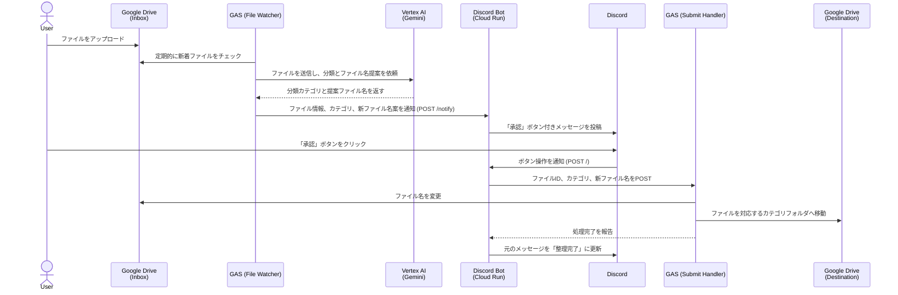

# Drive Sentinel

## 1. 概要

Drive Sentinelは、Google Driveにアップロードされたファイルを自動的に分類し、Discord上での簡単な承認操作で指定のフォルダに整理するシステムです。請求書、領収書、契約書などのドキュメントを、AIによる内容解析とリネーム提案を経て、手間なくファイリングすることを目的とします。

## 2. セットアップ手順

本システムを動作させるには、GCP、Google Drive、GAS、Discord Botの連携設定が必要です。

### 2.1. GCP (Google Cloud Platform) の設定

1.  **サービスアカウントの作成:**
    *   GCPコンソールで、本システムが使用するサービスアカウントを新規作成します。
    *   作成したサービスアカウントに「**Vertex AI ユーザー**」のIAMロールを付与します。
2.  **サービスアカウントキーの作成:**
    *   作成したサービスアカウントのキー管理画面で、新しいキーを作成し、**JSON形式**でダウンロードします。このファイルは後ほどGASの設定で使用します。

### 2.2. Google Drive の設定

1.  **フォルダの準備:**
    *   ファイルをアップロードするための「インボックス」フォルダ (例: `DocSentinel_Inbox`)。
    *   分類済みファイルを保存するための「保存先ルート」フォルダ (例: `DocSentinel_Archive`)。
    *   上記2つのフォルダをGoogle Drive上に作成します。
2.  **フォルダの共有:**
    *   上記で作成した**2つのフォルダ**を、2.1で作成したサービスアカウントのメールアドレス（`...@...gserviceaccount.com`）と共有し、「**編集者**」の権限を付与します。

### 2.3. Google Apps Script (GAS) の設定

1.  **スクリプトの作成:**
    *   Google Driveで新規にApps Scriptプロジェクトを作成し、このリポジトリの `GAS` ディレクトリ内にあるすべての `.gs` ファイル (`auth.gs`, `ai_classifier.gs`, `drive_sentinel_file_watcher.gs`, `drive_sentinel_submit_handler.gs`) の内容を、GASプロジェクトにそれぞれコピー＆ペーストしてファイルを作成します。
2.  **スクリプトプロパティの設定:**
    *   エディタの左メニュー「プロジェクトの設定」(歯車アイコン) を開き、「スクリプト プロパティ」セクションで以下のキーと値を設定します。
    *   **`GCP_SERVICE_ACCOUNT_KEY`**: 手順2.1でダウンロードしたサービスアカウントの **JSONキーファイルの中身をすべて**ここに貼り付けます。
    *   **`INBOX_FOLDER_ID`**: 手順2.2で作成した「インボックス」フォルダのID。（フォルダURLの `.../folders/` 以降の文字列）
    *   **`DESTINATION_ROOT_FOLDER_ID`**: 手順2.2で作成した「保存先ルート」フォルダのID。
    *   その他、後述する「設定項目」の表に従い、必要な値をすべて設定してください。
3.  **トリガーの設定:**
    *   エディタの左メニュー「トリガー」(時計アイコン) を開き、「トリガーを追加」をクリックします。
    *   **実行する関数:** `checkNewFilesAndNotify`
    *   **イベントのソース:** `時間主導型`
    *   **時間ベースのトリガーのタイプ:** `分ベースのタイマー`
    *   **時間の間隔:** `10分おき` (任意)
    *   上記のように設定し、保存します。
4.  **Webアプリのデプロイ:**
    *   `drive_sentinel_submit_handler.gs` の `doPost` 関数を公開するため、GASプロジェクトをWebアプリとしてデプロイします。
    *   画面右上の「デプロイ」>「新しいデプロイ」をクリックします。
    *   「種類の選択」で「ウェブアプリ」を選択します。
    *   「アクセスできるユーザー」を「**全員**」に設定し、デプロイします。
    *   デプロイ後に表示される **WebアプリURL** を控えておきます。これはDiscord Botの設定で使用します。

### 2.4. Discord Bot の設定

*   `discord-bot` ディレクトリのコードをCloud Runなどのサーバーレス環境にデプロイします。
*   デプロイ時に、後述する「設定項目」に従って環境変数を設定します。特に `GAS_WEBAPP_URL` には、手順2.3で取得したWebアプリURLを設定します。

---

## 3. システム構成図

## 4. コンポーネント詳細
(省略。元の内容と同じ)

## 5. 設定項目

### 5.1. GAS スクリプトプロパティ

| キー                           | 説明                                                               |
| ------------------------------ | ------------------------------------------------------------------ |
| `GCP_SERVICE_ACCOUNT_KEY`      | サービスアカウントの認証情報（JSONキーの中身全体）。               |
| `INBOX_FOLDER_ID`              | 監視対象のGoogle DriveフォルダのID。                               |
| `DESTINATION_ROOT_FOLDER_ID`   | 分類済みファイルを保存する親フォルダのID。                         |
| `GCP_PROJECT_ID`               | Vertex AI (Gemini) を使用するためのGCPプロジェクトID。            |
| `GCP_LOCATION`                 | Vertex AIのエンドポイントリージョン (例: `us-central1`)。          |
| `BOT_API_URL`                  | Discord Bot (Cloud Run) の `/notify` エンドポイントのURL。         |
| `GAS_API_KEY`                  | Botへのリクエストを認証するための共有APIキー。                     |

### 5.2. Discord Bot 環境変数 (Cloud Run)

| 環境変数                         | 説明                                                               |
| -------------------------------- | ------------------------------------------------------------------ |
| `DISCORD_PUBLIC_KEY`             | Discordアプリケーションの公開鍵。                                  |
| `GAS_WEBAPP_URL`                 | GAS Submit HandlerのWebアプリURL。                                 |
| `DISCORD_APPLICATION_ID`         | DiscordアプリケーションのID。                                      |
| `DISCORD_BOT_TOKEN`              | Discord Botのトークン。                                            |
| `DISCORD_CHANNEL_ID`             | 通知を送信するDiscordチャンネルのID。                              |
| `GAS_API_KEY`                    | GASからのリクエストを認証するための共有APIキー。                   |

