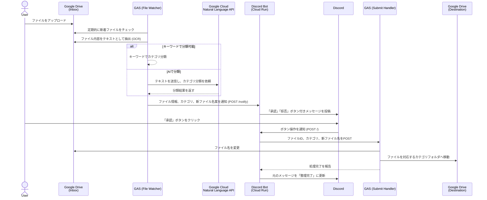

# システム仕様書: Drive Sentinel

## 1. 概要

Drive Sentinelは、Google Driveにアップロードされたファイルを自動的に分類し、Discord上での簡単な承認操作で指定のフォルダに整理するシステムです。請求書、領収書、契約書などのドキュメントを、AIによる内容解析とリネーム提案を経て、手間なくファイリングすることを目的とします。

## 2. システム構成図

## 3. 主要機能

*   **ファイル自動監視:** 指定されたGoogle Driveフォルダを定期的に監視し、新しいファイルを自動で検知します。
*   **AIによる自動分類:**
    *   **キーワード分類:** 「請求書」「領収書」などの定義済みキーワードがファイル内に含まれる場合、即座にカテゴリを特定します。
    *   **AI分類:** キーワードで分類できない場合、Google Cloud Natural Language APIを利用してファイルの内容を解析し、最適なカテゴリを推測します。
*   **ファイル名の自動提案:** `YYYY-MM-DD_カテゴリ名.拡張子` の形式で、整理に最適なファイル名を自動で生成・提案します。
*   **AIによるファイル名提案:** AIがファイル内容を分析し、`YYYY-MM-DD_内容の要約.拡張子` のような分かりやすいファイル名を自動で生成・提案します。
*   **Discordによる承認ワークフロー:** 分類結果と提案ファイル名をDiscordに通知します。ユーザーは「承認」ボタンをクリックするだけで、ファイルの整理を実行できます。
*   **自動リネームとフォルダ移動:** 承認されると、ファイルは提案された名前にリネームされ、カテゴリに対応したフォルダへ自動的に移動します。

## 4. コンポーネント詳細

### 4.1. Google Apps Script (GAS)

#### a. `drive_sentinel_file_watcher.gs`
時間ベースのトリガーで定期実行されるスクリプトです。

*   **役割:** 受信トレイフォルダを監視し、新着ファイルの分類とDiscordへの通知を行います。
*   **処理フロー:**
    1.  新着ファイルを検知します。
    2.  ファイルがPDFや画像の場合、Google Drive APIのOCR機能を用いてテキストを抽出します。
    3.  `classifyByKeywords`関数で、テキストがキーワードに合致するか判定します。
    4.  合致しない場合、`classifyDocument`関数でGCP Natural Language APIに分類を依頼します。
    5.  AIからの分類結果とファイル名提案を元に、新しいファイル名を決定します。
    6.  `sendDiscordNotification`関数で、Discord Botの`/notify`エンドポイントに処理結果をPOSTします。

#### b. `drive_sentinel_submit_handler.gs`
Webアプリとしてデプロイされ、Discord Botからのリクエストを受け付けます。

*   **役割:** 承認されたファイルの移動とリネーム処理を実行します。
*   **処理フロー:**
    1.  `doPost`関数で、BotからのPOSTリクエスト（`fileId`, `folderName`, `newFileName`）を受け取ります。
    2.  `getOrCreateFolder`関数で、指定されたカテゴリ名のフォルダがなければ作成します。
    3.  ファイルIDを元にファイルを取得し、指定された新しいファイル名にリネームします。
    4.  ファイルをカテゴリフォルダに移動します。
    5.  Botに成功メッセージを返します。

### 4.2. Discord Bot (Node.js on Cloud Run)

`app.js`として実装され、サーバーレスコンテナ環境（Cloud Run）で稼働します。

*   **役割:** GASとDiscordの間のインタラクションを仲介します。
*   **エンドポイント:**
    *   `POST /notify`: GASからのファイル分類結果を受け取ります。APIキーでリクエストを認証し、ボタン付きのEmbedメッセージをDiscordに投稿します。
    *   `POST /`: Discordからのボタンインタラクションを受け取ります。公開鍵でリクエストを検証し、承認/拒否の処理を振り分けます。
        *   **承認時:** GASのSubmit Handler (`doPost`) にファイル整理を依頼し、GASからの応答に応じて元のDiscordメッセージを更新します。
        *   **拒否時:** 元のDiscordメッセージを「拒否されました」に更新し、ボタンを無効化します。

## 5. 設定項目

### 5.1. GAS スクリプトプロパティ

| キー                           | 説明                                                               |
| ------------------------------ | ------------------------------------------------------------------ |
| `INBOX_FOLDER_ID`              | 監視対象のGoogle DriveフォルダのID。                               |
| `DESTINATION_ROOT_FOLDER_ID`   | 分類済みファイルを保存する親フォルダのID。                         |
| `GCP_PROJECT_ID`               | Natural Language APIを使用するためのGCPプロジェクトID。            |
| `BOT_API_URL`                  | Discord Bot (Cloud Run) の `/notify` エンドポイントのURL。         |
| `GAS_API_KEY`                  | Botへのリクエストを認証するための共有APIキー。                     |

### 5.2. Discord Bot 環境変数 (Cloud Run)

| 環境変数                         | 説明                                                               |
| -------------------------------- | ------------------------------------------------------------------ |
| `DISCORD_PUBLIC_KEY`             | Discordアプリケーションの公開鍵。                                  |
| `GAS_WEBAPP_URL`                 | GAS Submit HandlerのWebアプリURL。                                 |
| `DISCORD_APPLICATION_ID`         | DiscordアプリケーションのID。                                      |
| `DISCORD_BOT_TOKEN`              | Discord Botのトークン。                                            |
| `DISCORD_CHANNEL_ID`             | 通知を送信するDiscordチャンネルのID。                              |
| `GAS_API_KEY`                    | GASからのリクエストを認証するための共有APIキー。                   |
